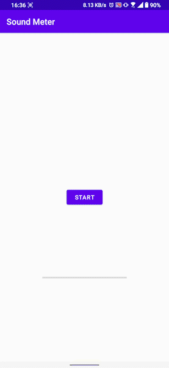

# Lib Sound meter

###### Current version:

[](https://jitpack.io/#volnoor/Lib-Sound-Meter)

## Quick start
-------

1. Add the JitPack repository to your build file:

```groovy
allprojects {
    repositories {
        maven { url 'https://jitpack.io' }
    }
}
```

2. Add the dependency:

```groovy
dependencies {
    implementation 'com.github.volnoor:Lib-Sound-Meter:current-version'
}
```

3. Setup `SoundMeter`:

```kotlin
val soundMeter = SoundMeter(this)
soundMeter.addListener {
    val soundLevelValueDb = it.roundToInt()
}
```

4. Start updates:

```kotlin
soundMeter.start()
```

> Note that `Manifest.permission.RECORD_AUDIO` permission must be granted before calling this method.

## Showcase
